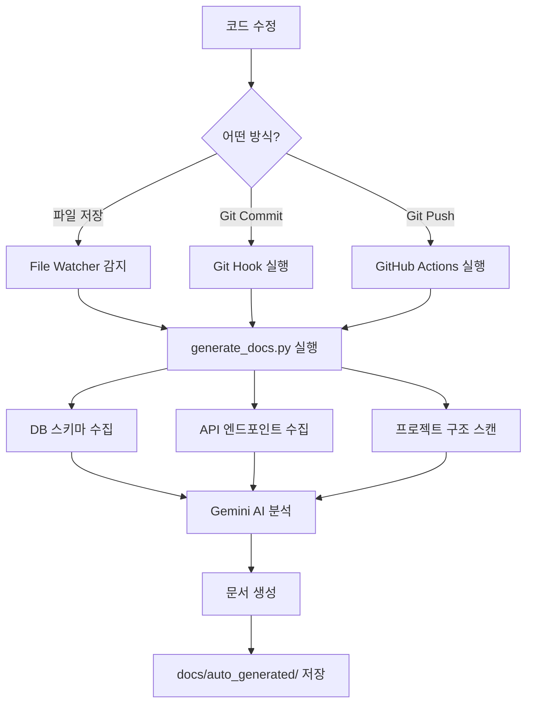

# 🔍 Monewment CCTV 자동 문서화 시스템

## 📋 개요
Monewment CCTV는 코드 변경을 자동으로 감지하고 실시간으로 문서를 생성하는 **완전 자동화 시스템**입니다.

---

## 🚀 구성 요소

### 1. **GitHub Actions** (원격 자동화)
- **트리거**: 모든 브랜치에 push 시 자동 실행
- **작동**: GitHub 서버에서 문서 생성 후 자동 커밋
- **파일**: `.github/workflows/ci.yml`

### 2. **Git Hook** (로컬 자동화)
- **트리거**: `git commit` 실행 시 자동 실행
- **작동**: 커밋 전에 문서 생성 후 자동 포함
- **파일**: `.git/hooks/pre-commit`

### 3. **File Watcher** (실시간 감시)
- **트리거**: 파일 저장 시 즉시 실행
- **작동**: 백그라운드에서 파일 변경 감지
- **파일**: `scripts/watch_and_doc.py`

---

## ⚙️ 설치 방법

### 1단계: Git Hook 설치 (필수)
```powershell
# PowerShell에서 실행
.\scripts\install_git_hook.ps1
```

### 2단계: File Watcher 실행 (선택)
```powershell
# 백그라운드 실행
python scripts/watch_and_doc.py
```

---

## 📖 사용 방법

### 자동 모드 (권장)
1. 코드를 수정하고 저장
2. `git add .`
3. `git commit -m "feat: 새 기능 추가"`
4. **자동으로 문서가 생성되고 커밋에 포함됨** ✅

### 수동 모드
```powershell
# 수동으로 문서 생성
python scripts/generate_docs.py
```

### 실시간 감시 모드
```powershell
# 파일 감시자 시작
python scripts/watch_and_doc.py

# 이제 파일을 저장할 때마다 자동으로 문서 생성
# 종료: Ctrl+C
```

---

## 📂 생성되는 문서

| 파일 | 내용 | 위치 |
|------|------|------|
| `DATA_SCHEMA.md` | DB 스키마 정보 | `docs/auto_generated/` |
| `API_SPEC.md` | API 엔드포인트 목록 | `docs/auto_generated/` |
| `CONFIG_MAP.md` | 환경 설정 정보 | `docs/auto_generated/` |
| `STRUCTURE.md` | 프로젝트 구조 분석 | `docs/` |

---

## 🔧 설정

### 감시 대상 디렉토리
- `src/` - 백엔드 코드
- `gui/` - 프론트엔드 코드
- `docs/` - 문서 파일

### 감시 대상 확장자
- `.py` - Python 파일
- `.tsx`, `.ts` - TypeScript/React 파일
- `.yml`, `.yaml` - 설정 파일
- `.json` - JSON 파일

### 제외 디렉토리
- `__pycache__`, `.git`, `node_modules`, `.next`, `.venv`, `dist`, `build`

---

## 🛠️ 문제 해결

### Git Hook이 작동하지 않을 때
```powershell
# Hook 재설치
.\scripts\install_git_hook.ps1

# Hook 파일 권한 확인
ls .git\hooks\pre-commit
```

### File Watcher가 작동하지 않을 때
```powershell
# watchdog 라이브러리 설치 확인
pip install watchdog

# 수동 실행 테스트
python scripts/watch_and_doc.py
```

### GitHub Actions가 작동하지 않을 때
1. GitHub 저장소의 **Actions** 탭 확인
2. `GEMINI_API_KEY` Secret 설정 확인
3. `.github/workflows/ci.yml` 파일 확인

---

## 📊 작동 흐름



---

## ⚡ 성능 최적화

### File Watcher 쿨다운
- 기본값: 5초
- 너무 자주 실행되는 것을 방지
- `scripts/watch_and_doc.py`에서 `COOLDOWN_SECONDS` 수정 가능

### GitHub Actions [skip ci]
- 문서 자동 커밋 시 `[skip ci]` 태그 사용
- 무한 루프 방지 (문서 커밋이 다시 Actions를 트리거하지 않음)

---

## 🎯 고급 기능

### 특정 파일만 감시
`scripts/watch_and_doc.py` 수정:
```python
WATCH_EXTENSIONS = {'.py'}  # Python 파일만 감시
```

### 문서 생성 스킵
```powershell
# Git Hook 임시 비활성화
git commit --no-verify -m "docs: skip auto-doc"
```

---

## 📝 로그 확인

### Git Hook 로그
```powershell
# 커밋 시 콘솔 출력 확인
git commit -m "test"
# 출력: 📝 [CCTV] 변경사항 감지 - 자동 문서 생성 시작...
```

### File Watcher 로그
```powershell
python scripts/watch_and_doc.py
# 실시간 로그 출력
```

### GitHub Actions 로그
- GitHub 저장소 → Actions 탭 → 최신 워크플로우 클릭

---

## 🔐 보안

### API 키 관리
- 로컬: `.env` 파일에 `GEMINI_API_KEY` 저장
- GitHub: Repository Settings → Secrets → `GEMINI_API_KEY` 등록

### 민감 정보 제외
- `.gitignore`에 `.env` 추가 (이미 설정됨)
- 문서에 민감 정보가 포함되지 않도록 주의

---

## 📚 참고 자료

- [GitHub Actions 문서](https://docs.github.com/en/actions)
- [Git Hooks 가이드](https://git-scm.com/book/en/v2/Customizing-Git-Git-Hooks)
- [Watchdog 라이브러리](https://python-watchdog.readthedocs.io/)

---

*Last Updated: 2026-01-07*  
*Monewment CCTV System v3.0*
